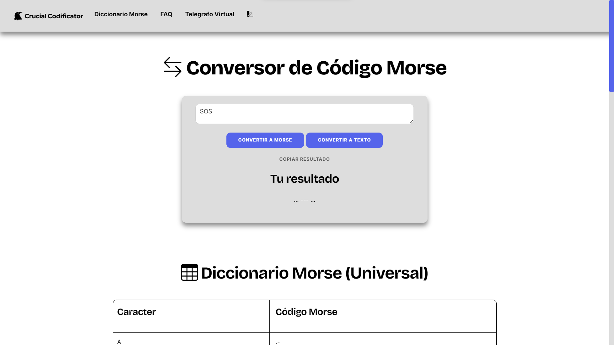

# Crucial Codificator
Codifica texto a morse y viceversa de forma instantánea y fácil!

P.D: Esto fue un proyecto estudiantil de página web estática desarrollado entre amigos, por lo tanto el código no es de muy buena calidad.
